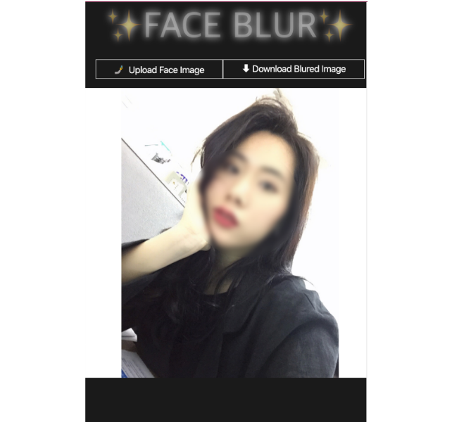

# 🤘 FACE BLUR 🤘

ReactJS

detects and blur faces in photos.🧏🏻‍♀️ 
You can save the blurred image file right away.

Support chrome web browser

 

## License

Copyright 2019 haeuncs

MIT

### Dependency

Copyright (c) 2018 [Vincent Mühler](https://github.com/justadudewhohacks/face-api.js/blob/master/LICENSE)

Copyright 2019 [supachaic](https://github.com/supachaic)

License: MIT
